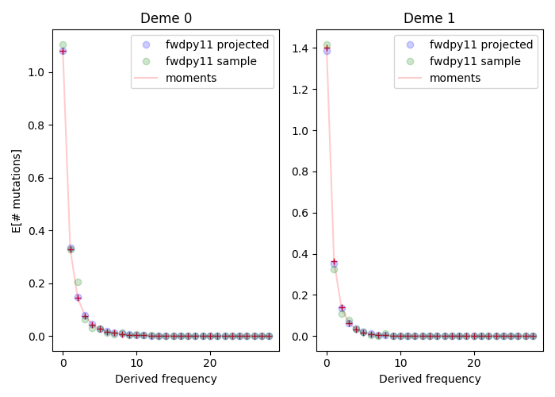

(imexample)=

# Isolation-with-migration (IM)

This example uses {func}`fwdpy11.demographic_models.IM.two_deme_IM` to run
simulations of an IM model and compare the results to the output of
[moments][moments] {cite}`Jouganous2017-tg`, which calculates the expected mutation
frequency spectrum using diffusion approximations.

The goal of the script is to get the expected frequency spectrum (`FS`)
for a sample taken from each deme.  We do this in two ways:

* We get the mean `FS` for each entire deme and then project it down
  to the `FS` for the desired sample size.
* We get the mean `FS` for the desired sample size.

The final output is a figure showing the expectation obtained from `moments`
and the two mean `FS` from `fwdpy11`.  The figure shows the expectation
separately for both demes.

This script is a "deep dive" into this kind of modeling.  First,
we have to deal with how the model parameters are scaled, and the
fact that `fwdpy11` does things differently from `moments`.  The
difference between the two programs is especially tricky for the migration
rates, and we need to reverse their order when using `moments` to
get the expected frequency spectra.

This script applies {func}`fwdpy11.TableCollection.fs` to get the frequency
spectra from the simulations. See {ref}`tablefs` for more details on that
function.

:::{figure-md}


Example output from this script, generated by the command line
show below.  This simulation does not involve any mutations
affecting fitness.  Deme 0 splits equally into demes 0 and 1 0.3
time units ago.  The two demes grow to 2 and 3 times the
ancestral population size, respectively, and migration
between demes is asymmetric.

:::

```{code-block} bash

python3 IM.py --Nref 1000 --N0 2 --N1 3 --split 0.5 -T 0.3 --migrate 2.0 0.5  --seed $RANDOM --nreps 64 --theta 100

```

:::{figure-md}


An example with selection, run using the command line shown below.
In this example, the scaled strength of selection is {math}`\gamma=2N_{ref}s=-5`
for all new mutations.  In order to match diffusion results, `4Nu`
must be low, else we risk seeing bizarre dynamics due to the
interplay of a high mutation rate to mutations affecting fitness
and insufficient recombination.  Due to the low mutation rate,
we must run more replicates.  The "projected" `FS` look great,
but there's still some noise in the "real" `FS` because the sample
size is rather small (15 diploids per deme).

:::

```{code-block} bash

python3 IM.py --Nref 1000 --N0 2 --N1 3 --split 0.5 -T 0.3 --migrate 2.0 0.5  --seed $RANDOM --nreps 512 --theta 1 --gamma -5

```

```{literalinclude} ../../examples/discrete_demography/IM.py

```

[moments]: https://bitbucket.org/simongravel/moments


