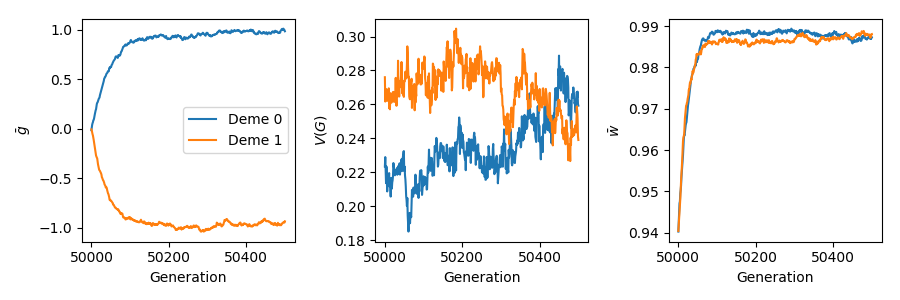

.. _localadaptation:

Local adaptation of a quantitative trait
==========================================================

   Example output from this script. The command line shown below
   generated this image.

.. code-block:: bash

   python3 examples/discrete_demography/localadaptation.py -N 5000 --rho 10000 --mu 0.005 --sigma 0.10 --migrates 1e-4 1e-4 --plotfile localadaptation.png

The script below executes the following simulation:

* Two demes of size ``N`` evolve for ``10N`` generations with or without migration.
* Mutations arise at rate ``mu`` and generate mutations with additive effects
  on a quantitative trait.  The genotype to phenotype model is additive.
* Effect sizes are Gaussian distributed with mean 0 and standard deviation
  ``sigma``.
* The scaled recombination rate is :math:`\rho = 4Nr`.
* For the first ``10N`` generations, the demes evolve under Gaussian stabilizing
  selection to an optimum trait value of 0.  Then, the optimum changes to ``opt``
  in deme 0 and ``-opt`` in deme 1.  The simulation continues for ``time*N``
  more generations.
* By default, ``VS=10`` and the new ``opt`` is 1.0.

Optionally, summaries of phenotypic variation are plotted to ``plotfile`` 
using ``matplotlib`` at the end of the simulation.

.. literalinclude:: ../../examples/discrete_demography/localadaptation.py

