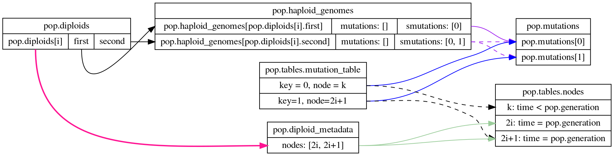

.. _typeoverview:

Overview of types
=============================================

This section is a conceptual overview of how a population of diploids is represented
by :class:`fwdpy11.DiploidPopulation`.

    Fig 1: The relationship between (some of) the data structures in a population.

Figure 1 is an abstract representation of some of the more important members of :class:`fwdpy11.DiploidPopulation`,
focusing on how we can get genotype information about diploids.  As it turns out there are two ways to accomplish 
this:

1. From the diploid genomes themselves.
2. From the tree sequences reflecting the history of the simulation.

Regarding the genomes themselves, the relevant concepts are:

* A diploid is made up of two haploid genomes, one from each parent.
* A haploid genome is represented by :class:`fwdpy11.HaploidGenome`.
* Haploid genomes are stored in :attr:`fwdpy11.PopulationBase.haploid_genomes`.
* A diploid is represented by :class:`fwdpy11.DiploidGenotype`, whose attributes
  :attr:`fwdpy11.DiploidGenotype.first` and :attr:`fwdpy11.DiploidGenotype.second`
  refer to *indexes* in :attr:`fwdpy11.PopulationBase.haploid_genomes`
* Instances of :class:`fwdpy11.DiploidGenotype` are stored in :attr:`fwdpy11.DiploidPopulation.diploids`

.. note::
   
    The only valid interpretation of :attr:`fwdpy11.DiploidGenotype.first` and :attr:`fwdpy11.DiploidGenotype.second`
    is that they are indexes into another container.  Identical values therefore index the same instance
    of :class:`fwdpy11.HaploidGenome`.  However, different values may index different instances that contain  
    the same mutations, as there no attempt to keep :attr:`fwdpy11.PopulationBase.haploid_genomes` "minimal" (containing
    only unique genomes).  This situation can occur when the diploid genotype AB/ab recombines to generate Ab and aB
    gametes multiple times in a generation.

To go from haploid genomes to their mutations:

* Mutations are represented by :class:`fwdpy11.Mutation`
* Mutation instances are stored in :attr:`fwdpy11.PopulationBase.mutations`.
* Instances of haploid genomes store *indexes* into :attr:`fwdpy11.PopulationBase.mutations`.
* These indexes are stored *separately* for neutral and selected mutations in
  :attr:`fwdpy11.HaploidGenome.mutations` and :attr:`fwdpy11.HaploidGenome.smutations`,
  respectively.

.. note::

    The attributes :attr:`fwdpy11.PopulationBase.haploid_genomes`, :attr:`fwdpy11.PopulationBase.mutations`,
    and :attr:`fwdpy11.DiploidPopulation.diploids` mostly behave as regular Python lists.  However,
    they are actually C++ containers and some magic has been done to allow you to access their
    data very efficiently.

These relationships are shown in Figure 1.  The :math:`i^{th}` diploid's members `first` and `second` are *indexes*
to the corresponding haploid genomes (black arrows with solid lines).  Those :class:`fwdpy11.HaploidGenome` objects
contain attributes :attr:`fwdpy11.HaploidGenome.mutations` and :attr:`fwdpy11.HaploidGenome.smutations`, which store
*indexes* of neutral and selected mutations, respectively (solid and dashed purple lines).  The mutations are instances
of :class:`fwdpy11.Mutation`.

Let's take a look at the population simulated in :ref:`introexample`.

The indexes of the genomes of the first diploid are:

.. ipython:: python

    print(pop.diploids[0].first, pop.diploids[0].second)

Let's print the contents of those genomes and some type info:

.. ipython:: python

    for i in (pop.diploids[0].first, pop.diploids[0].second):
        print(
            pop.haploid_genomes[i].smutations,
            type(pop.haploid_genomes[i].smutations),
            pop.haploid_genomes[i].smutations.dtype,
        )

So we see that mutation indexes are stored in numpy arrays.

.. note::

    :attr:`fwdpy11.HaploidGenome.mutations` is empty in simulations 
    with tree sequences!  Neutral variants are added after-the-fact
    and are processed entirely from the tree sequence.

Let's take a look at the mutations for one of the genomes:

.. ipython:: python

    for k in pop.haploid_genomes[pop.diploids[0].first].smutations:
        print(
            k,
            "-> {0:0.2f} {1:0.0f} {2:0.2f}".format(
                pop.mutations[k].pos, pop.mutations[k].g, pop.mutations[k].s
            ),
        )

The outputs are the mutation index, followed by the position,
generation when the mutation arose, and the mutation's effect size.
See :class:`fwdpy11.Mutation` for more attributes associated
with this type.

Before discussing getting genotype data using tree sequences, it is helpful to in introduce
the metadata types associated with diploids:

Diploid metadata
----------------------------------------------------------------

In addition to the genomes, individuals are associated metadata represented as
instances of :class:`fwdpy11.DiploidMetadata`, stored in
:attr:`fwdpy11.DiploidPopulation.diploid_metadata`.  Let's look at the data for
our first few individuals:

.. ipython:: python

    for i in pop.diploid_metadata[:5]:
        print(i)

The fields are defined in the class documentation.

An important point regarding efficiency is that we may view the data as a structured
array:

.. ipython:: python

    md = np.array(pop.diploid_metadata, copy=False)
    print(md.dtype)
    print(md[:5])

For many applications, access via a structured array should be preferred, as it will outperform
the access via Python objects by an order of magnitude or so.

.. note::
   
   The metadata are stored in the same order as the diploids themselves.  The `label` field
   contains the index of the :class:`fwdpy11.DiploidGenotype` in :attr:`fwdpy11.DiploidPopulation.diploids`.
   The same idea holds for ancestral sample metadata as well.

Tree sequences
----------------------------------------------

It may be useful to read the following sections for background:

* :ref:`tsoverview`
* :ref:`ts_data_types`

In :ref:`tsoverview`, we define a convention of labelling the *nodes* corresponding to the
haploid genomes of a diploid individual with adjactent integers.  For the current generation of a diploid population,
and assuming that the tree sequences are simplified, the nodes corresponding to our :math:`N` diploids have integer labels
:math:`[0, 2N)`.  The haploid genomes of individual 0 correspond to nodes 0 and 1, respectively, etc., and we can get
the node labels from the metadata:

.. note::

   It is important to realize that the node indexes corresponding to a diploid have no relationship
   to the values stored in instances of :class:`fwdpy11.DiploidGenotype`.

.. ipython:: python

    print(pop.diploid_metadata[0].nodes)

We can relate this output to Figure 1.  The :math:`i^{th}` metadata element contains the nodes for the :math:`i^{th}` 
diploid.

Let's use :class:`fwdpy11.VariantIterator` to determine which selected mutations are in the first diploid. We will have
to filter on neutral-vs-selected because neutral mutations have been added to the table collection:

.. ipython:: python

    keys = []
    vi = fwdpy11.VariantIterator(
        pop.tables, pop.diploid_metadata[0].nodes, include_neutral_variants=False
    )
    for v in vi:
        r = v.records[0]
        keys.append(r.key)
    print(keys)

The `r` variable is an instance of :class:`fwdpy11.MutationRecord`, which are stored in :class:`fwdpy11.MutationTable`
instances as part of table collections.  As we see in Figure 1, these records have "keys", which are indexes back to 
:attr:`fwdpy11.PopulationBase.mutations`, and nodes, which are indexes into :class:`fwdpy11.NodeTable` instances.

The variable `keys` hold the same values that we saw above when we interated over haploid genomes.

Let's create the full genotype matrix for this individual at selected variants:

.. ipython:: python

    genotypes = np.array([], dtype=np.int8)
    vi = fwdpy11.VariantIterator(
        pop.tables, pop.diploid_metadata[0].nodes, include_neutral_variants=False
    )
    for v in vi:
        r = v.records[0]
        genotypes = np.concatenate((genotypes, v.genotypes))
    genotypes = genotypes.reshape(len(keys), 2)
    print(genotypes)

The output follows the "ms" convention of labelling the ancestral state zero and the derived state one.
Unlike ms, but like msprime's Python API, the matrix is written with sites as rows and haplotypes as columns.
    
The individual is heterozygous only for the second row, which corresponds to the second key with value 11.

The examples using :class:`fwdpy11.VariantIterator` are examples of efficient algorithms on tree sequences, of the sort
described in Kelleher *et al.* (2016), in the paper describing msprime_.   You also have access to the raw tables
themselves:

* :attr:`fwdpy11.PopulationBase.tables` is an instance of :class:`fwdpy11.TableCollection`, whose attributes include the node, edge,
  and mutation tables.

Each of the tables may be interacted with as regular Python objects or as structured arrays.  The latter is much more
performant.  Let us find all edges that lead to the two genomes of the first diploid:

.. ipython:: python

    e = [i for i in pop.tables.edges if i.child == 0 or i.child == 1]
    print(e)

The times associated with the parents are:

.. ipython:: python

    for ei in e:
        print(pop.tables.nodes[ei.parent].time)

Repeating the above using structured arrays:

.. ipython:: python

    edges = np.array(pop.tables.edges, copy=False)
    nodes = np.array(pop.tables.nodes, copy=False)
    edge_indexes = ((edges["child"] == 0) | (edges["child"] == 1)).nonzero()
    print(edges[edge_indexes])
    print(nodes["time"][edges["parent"][edge_indexes]])

The relevant numpy dtypes are:

.. ipython:: python

    print(edges.dtype)
    print(nodes.dtype)

.. _msprime: https://msprime.readthedocs.io
