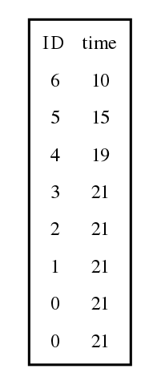

.. _ts_data_types:

Data structures related to tree sequences
======================================================================

To start out, let us consider the follwing tree:

.. figure:: ../images/tree.png

        Fig 1: A tree with seven nodes.

This tree is the "marginal" history of a genomic segment covering the half-open interval :math:`[l, r)`.

Following Kelleher _et al._ (2016, PLoS Computational Biology), we can represent the above tree using two tables:

       Fig 2: The node table corresponding to figure 1.

Low-level data types
----------------------------------------------------------

Table collections
----------------------------------------------------------

